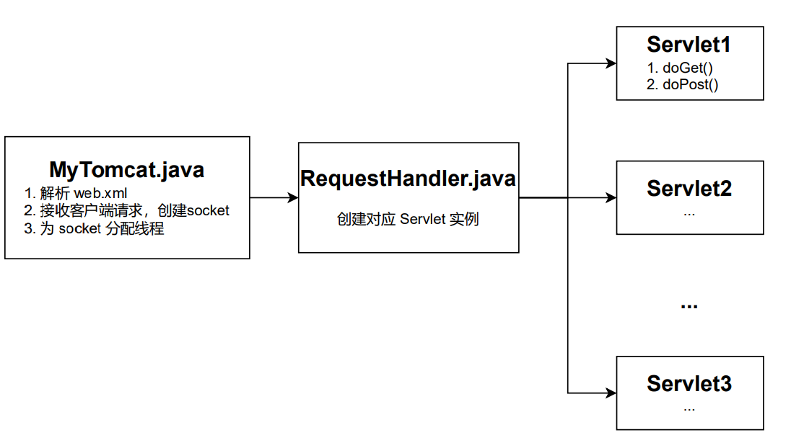

# MyTomcat

## 一、功能介绍

Tomcat 是一个中间件，接收客户端发出的请求，转发到目的服务器。目的服务器返回响应消息，通过Tomcat返回给浏览器。这些也是 MyTomcat 要实现的功能。



## 二、详细设计

### 1. 客户端与服务端通信

通过 socket 即可建立客户端与服务端的通信。

`Socket socket = serverSocket.accept()` 等待并接收来自客户端的请求。

通过 `socket.getInputStream()` 获取输入流对象，接收来自客户端的数据。

```java
BufferedReader read=new BufferedReader(new InputStreamReader(inputStream,"utf-8"));
//取HTTP请求响应的第一行，GET /user HTTP/1.1，按空格隔开
String[] data=read.readLine().split(" ");
//取uri和method
uri=data[1];
method=data[0];
```

通过 `socket.getOutputStream()` 获取输出流对象，像客户端返回消息。

客户端只能识别符合 HTTP 响应协议的数据，所以响应内容：
```java
String resp = "HTTP/1.1 200"+"\r\n"+"Content-Type：text/html"+"\r\n"+"\r\n"+resp_msg;
outputStream.write(resp.getBytes());
outputStream.flush();
```

### 2. 为连接分配线程

创建一个 RequestHandler 类对象，用于执行客户端请求。对于每一个连接，都开启一个线程：
```java
RequestHandler requestHandler=new RequestHandler(socket);
new Thread(requestHandler).start();
```

### 3. 实现 Servlet

Servlet 用来接收、处理客户端的请求，以及将服务器响应的动态数据返回给客户端。

- publica void service(Request request, Response response): 接收到请求时就会被调用，根据方法类型选择 doPost 方法 和 doGet 方法；
- public abstract void doGet(Request request, Response response): 抽象方法，留给具体业务实现；
- public abstract void doPost(Request request, Response response): 同 doGet() 方法；

### 4. 解析 web.xml

实现一个 MyTomcat 类来解析 web.xml。web.xml 示例：
```xml
<?xml version="1.0" encoding="UTF-8"?>
<web-app version="2.4"
         xmlns="http://java.sun.com/xml/ns/j2ee"
         xmlns:xsi="http://www.w3.org/2001/XMLSchema-instance"
         xsi:schemaLocation="http://java.sun.com/xml/ns/j2ee http://java.sun.com/xml/ns/j2ee/web-app_2_4.xsd">
    <display-name>Archetype Created Web Application</display-name>
    <servlet>
        <servlet-name>userServlet</servlet-name>
        <servlet-class>com.example.UserServlet</servlet-class>
    </servlet>
    <servlet-mapping>
        <servlet-name>userServlet</servlet-name>
        <url-pattern>/user</url-pattern>
    </servlet-mapping>
</web-app>
```

可以通过 SAXReader 来解析 xml 文件。

第一个映射：`servlet-name` 到 `servlet-class`。这里要通过反射来实例化相应的 serlvet 类对象：

```java
public static final HashMap<String, MyHttpServlet> servletMapping=new HashMap<String, MyHttpServlet>();

servletMapping.put(servletName.getText(),(MyHttpServlet) Class.forName(servletClass.getText().trim()).newInstance());
```

第二个映射：`servlet-name` 到 `url-pattern`。这里直接保存即可：

```java
public static final HashMap<String,String> urlMapping=new HashMap<String, String>();

urlMapping.put(urlPattern.getText(),servletName.getText());
```

相应的，RequestHandler 中需要加入对 url 的解析：

```java
String servletName=MyTomcat.urlmapping.get(uri);
//根据servletName得到Servlet对象，如果web.xml文件中有映射就不为空
MyHttpServlet servlet= MyTomcat.servletMapping.get(servletName);
if(servlet!=null) {
    servlet.service(request, response);
} else {
    //...
}
```


## 三、参考资料
1. [从零开始手写Tomcat，一文彻底搞懂Tomcat运行流程（附源码）](https://blog.csdn.net/qq_41973594/article/details/102712793)
2. [【Java】反射之Class.forName()](https://blog.csdn.net/wk1134314305/article/details/77951644)
